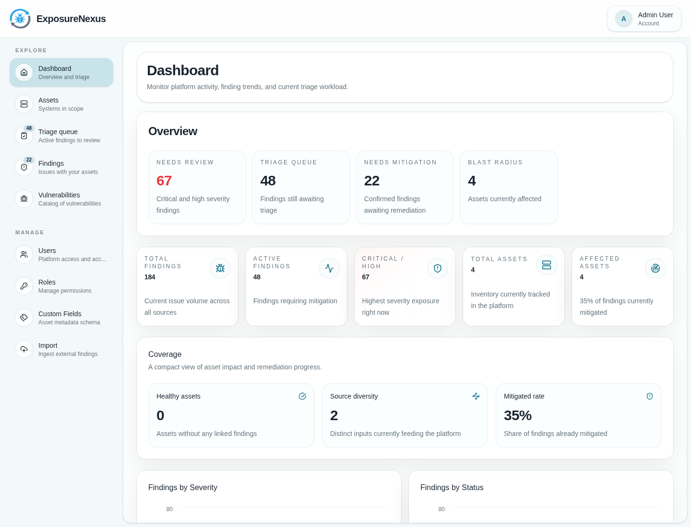

# ExposureNexus

[](https://github.com/s-schoen/exposurenexus/actions/workflows/ci.yml)
[](https://codecov.io/gh/s-schoen/exposurenexus)
[](LICENSE)

ExposureNexus is an open-source continuous threat exposure management (CTEM) platform for organizing security
observations into asset-centered findings and tracking triage through remediation.

## Project Status

ExposureNexus is in early development. The current setup is intended for local evaluation and development, not as a
production deployment guide. Automated scanner import is work in progress; the import API currently returns `501 Not
Implemented` without processing uploaded data.



## Key Features

- Create findings manually and attach manual observations as supporting evidence.
- Review active findings in a triage queue grouped around affected assets.
- Track finding status from discovery through confirmation, mitigation, accepted risk, false positive, duplicate, or
  out-of-scope.
- Assign findings, set due dates, and manage remediation follow-up.
- Manage asset inventory, owners, and asset-specific custom fields.
- Browse the vulnerability catalog behind observed findings.
- Use role-based access control for viewer, editor, and admin workflows.

## How It Works

ExposureNexus models exposure-management work around four core objects:

- **Assets** are the systems or components affected by findings.
- **Findings** are human-facing workflow cases on assets.
- **Observations** are manual or scanner detection records attached to findings.
- **Vulnerabilities** are optional catalog entries linked to findings.

Teams can currently create and triage findings manually. Automated import into the observation-based model is planned but
not yet available.

## Quickstart

```bash
pnpm install
pnpm dev:api
pnpm dev:ui
```

The API and UI need local environment configuration before they can run successfully.
See [Development](docs/development.md) for PostgreSQL, environment variables, and workspace commands.

## Deployment

For a Docker Compose example that runs the production app image with PostgreSQL, see [Deployment](docs/deployment.md).

## Development

For local environment setup, PostgreSQL configuration, workspace commands, and project structure,
see [Development](docs/development.md).

## Security

Please report suspected vulnerabilities through GitHub private vulnerability reporting. See [SECURITY.md](SECURITY.md).

## License

MIT
